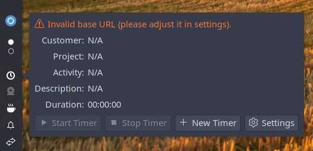
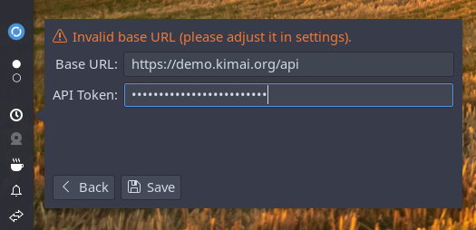
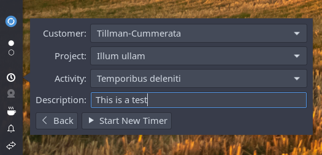
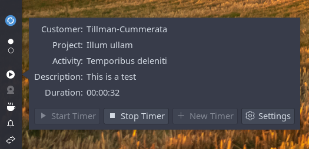

# Budgie Kimai Timetracker Applet

[](https://github.com/pgroenbaek/budgie-kimai-timetracker/releases)
[![License GNU GPL v3](https://img.shields.io/badge/License-%20%20GNU%20GPL%20v3%20-lightgrey?style=flat&logo=data:image/svg+xml;base64,PHN2ZyB4bWxucz0iaHR0cDovL3d3dy53My5vcmcvMjAwMC9zdmciIHZpZXdCb3g9IjAgMCA2NDAgNTEyIj4KICA8IS0tIEZvbnQgQXdlc29tZSBGcmVlIDYuNy4yIGJ5IEBmb250YXdlc29tZSAtIGh0dHBzOi8vZm9udGF3ZXNvbWUuY29tIExpY2Vuc2UgLSBodHRwczovL2ZvbnRhd2Vzb21lLmNvbS9saWNlbnNlL2ZyZWUgQ29weXJpZ2h0IDIwMjUgRm9udGljb25zLCBJbmMuIC0tPgogIDxwYXRoIGZpbGw9IndoaXRlIiBkPSJNMzg0IDMybDEyOCAwYzE3LjcgMCAzMiAxNC4zIDMyIDMycy0xNC4zIDMyLTMyIDMyTDM5OC40IDk2Yy01LjIgMjUuOC0yMi45IDQ3LjEtNDYuNCA1Ny4zTDM1MiA0NDhsMTYwIDBjMTcuNyAwIDMyIDE0LjMgMzIgMzJzLTE0LjMgMzItMzIgMzJsLTE5MiAwLTE5MiAwYy0xNy43IDAtMzItMTQuMy0zMi0zMnMxNC4zLTMyIDMyLTMybDE2MCAwIDAtMjk0LjdjLTIzLjUtMTAuMy00MS4yLTMxLjYtNDYuNC01Ny4zTDEyOCA5NmMtMTcuNyAwLTMyLTE0LjMtMzItMzJzMTQuMy0zMiAzMi0zMmwxMjggMGMxNC42LTE5LjQgMzcuOC0zMiA2NC0zMnM0OS40IDEyLjYgNjQgMzJ6bTU1LjYgMjg4bDE0NC45IDBMNTEyIDE5NS44IDQzOS42IDMyMHpNNTEyIDQxNmMtNjIuOSAwLTExNS4yLTM0LTEyNi03OC45Yy0yLjYtMTEgMS0yMi4zIDYuNy0zMi4xbDk1LjItMTYzLjJjNS04LjYgMTQuMi0xMy44IDI0LjEtMTMuOHMxOS4xIDUuMyAyNC4xIDEzLjhsOTUuMiAxNjMuMmM1LjcgOS44IDkuMyAyMS4xIDYuNyAzMi4xQzYyNy4yIDM4MiA1NzQuOSA0MTYgNTEyIDQxNnpNMTI2LjggMTk1LjhMNTQuNCAzMjBsMTQ0LjkgMEwxMjYuOCAxOTUuOHpNLjkgMzM3LjFjLTIuNi0xMSAxLTIyLjMgNi43LTMyLjFsOTUuMi0xNjMuMmM1LTguNiAxNC4yLTEzLjggMjQuMS0xMy44czE5LjEgNS4zIDI0LjEgMTMuOGw5NS4yIDE2My4yYzUuNyA5LjggOS4zIDIxLjEgNi43IDMyLjFDMjQyIDM4MiAxODkuNyA0MTYgMTI2LjggNDE2UzExLjcgMzgyIC45IDMzNy4xeiIvPgo8L3N2Zz4=&logoColor=%23ffffff)](/LICENSE)

This is a Budgie panel applet that allows you to connect to and track time using the Kimai Timetracker API.


## Installing
Find and download the `.deb` package in the [latest release](https://github.com/pgroenbaek/budgie-kimai-timetracker/releases).

Install using the command:
```bash
sudo dpkg -i budgie-kimai-timetracker-applet_<version>_amd64.deb
```

Replace `<version>` with the actual version number in the filename.

## Usage
1. Add the applet to your Budgie panel in the *Budgie Desktop Settings* application.

2. In the Kimai webapp, navigate to _"My Profile" -> "API Access" -> "Create"_ to create an API token.

3. Click the tray icon.



4. Go to settings and fill out base URL and API token.



5. Now you can create new timers and stop them. The applet will also update its status if you start and stop timers in the Kimai webapp.






## Building
### Prerequisites
Ensure you have the required dependencies installed:
```bash
sudo apt install budgie-core-dev
sudo apt install libgtk-3-dev libglib2.0-dev
sudo apt install libjson-glib-dev libsoup2.4-dev libsecret-1-dev
sudo apt install meson ninja-build valac
```


### Build Debian Package
First build the `.so` library:
```bash
meson setup build
ninja -C build
```

Then build a `.deb` package:
```bash
dpkg-buildpackage -us -uc
```

## Contributing

Contributions of all kinds are welcome. These could be suggestions, issues, bug fixes, documentation improvements, or new features.

For more details see the [contribution guidelines](/CONTRIBUTING.md).

## License

This Budgie panel applet was created by Peter Grønbæk Andersen and is licensed under [GNU GPL v3](/LICENSE).
